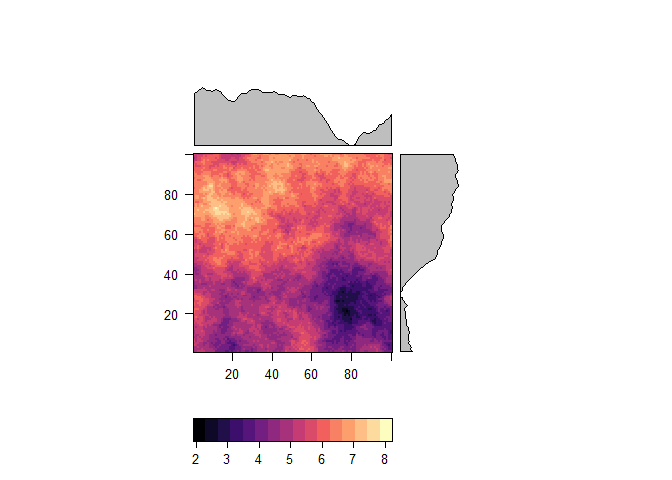
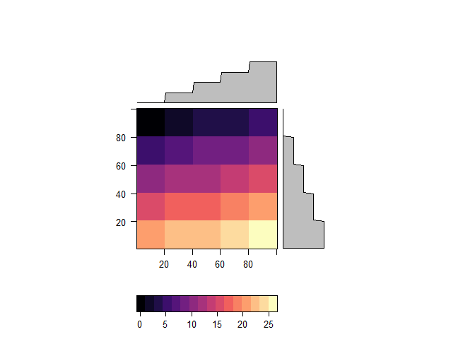
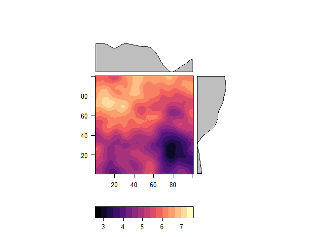
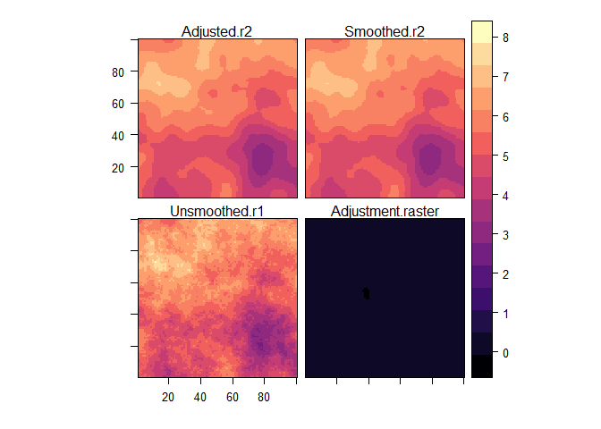
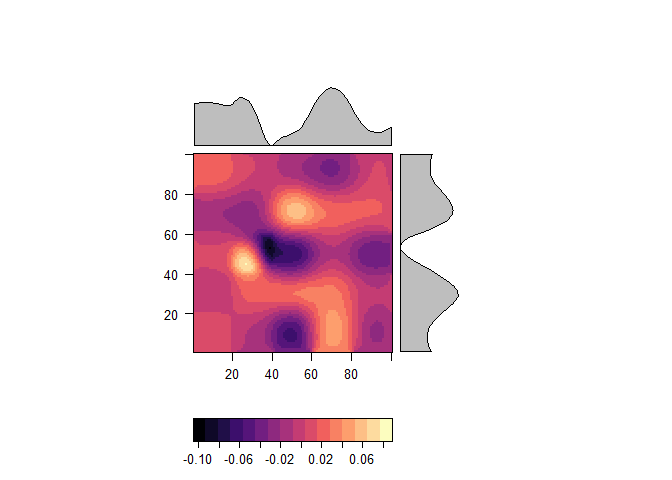

Smoodjustment 0.0.9999
================
M
Smoothing a raster layer results in a change in zonal counts over. For some applications, this is not desirable. Smoodjustment adjusts a smoothed raster so that, within specified zones the mass of the original unsmoothed raster is preserved.

In the most simple case, the adjustment can be made by increasing and lowering the values within a zone so that the two rasters' zonal mass match. However, this results in potential steps at the zone boundaries - a feature that smoothing is often used to eliminate. Smoodjustment smooths the adjustment layer using Tobler's pycnophylactic interpolation to create a smooth adjustment layer.

**Note: this is a very early version of the package designed for a specific purpose. Unexpected errors may occur with other uses.**

### Create some rasters

We create a random raster to be smoothed and adjusted

``` r
set.seed(5122019)
side <- 100 # size of one side
points <- data.frame(x = rep(1:side, each = side),
                     y = rep(1:side, times = side))
variogram <- vgm(psill=1, range=50, model='Exp')
spatial_model <- gstat(formula=z~1, locations=~x+y, dummy=T, beta=1, model=variogram, nmax=20)
prediction <- predict(spatial_model, newdata=points, nsim=1)
```

    ## [using unconditional Gaussian simulation]

``` r
gridded(prediction) = ~x+y
r <- raster(prediction) +5
crs(r) <- "+proj=eqc +lat_ts=0 +lat_0=0 +lon_0=0 +x_0=0 +y_0=0 +ellps=WGS84 +datum=WGS84 +units=m +no_defs"
levelplot(r)
```

 And lets create some zones

``` r
zones <- aggregate(r, 20)
raster::values(zones) <- 1:ncell(zones)
zones <- disaggregate(zones, 20)
levelplot(zones)
```



### smooth raster and adjust

``` r
r_smooth <- focal(r, w = matrix(1,9,9), fun='mean', pad=TRUE, na.rm=TRUE)
levelplot(r_smooth)
```



``` r
adjusted <- pycnophylactic_adjustment(r, r_smooth, zones, adjust_threshold = 0.5, n =50, intensive=FALSE, return_error = TRUE, verbose=FALSE)
```

    ## Preparing output..

``` r
levelplot(adjusted)
```



``` r
levelplot(adjusted$Adjustment.raster)
```



### Check that the masses hold

``` r
original <- raster::zonal(r, zones)
adj_smooth <- raster::zonal(adjusted$Adjusted.r2, zones)
all.equal(original, adj_smooth)
```

    ## [1] TRUE

``` r
differences <- cbind(original, 
                     adj_smooth = adj_smooth[,2],
                     difference = original[,2]-adj_smooth[,2])
colnames(differences)[2] <- "original"

differences
```

    ##       zone original adj_smooth    difference
    ##  [1,]    1 6.202929   6.202929  0.000000e+00
    ##  [2,]    2 6.355647   6.355647  0.000000e+00
    ##  [3,]    3 6.493551   6.493551  0.000000e+00
    ##  [4,]    4 6.300888   6.300888  0.000000e+00
    ##  [5,]    5 6.209866   6.209866 -8.881784e-16
    ##  [6,]    6 6.767273   6.767273  0.000000e+00
    ##  [7,]    7 6.612633   6.612633  0.000000e+00
    ##  [8,]    8 5.903989   5.903989  0.000000e+00
    ##  [9,]    9 5.478813   5.478813  0.000000e+00
    ## [10,]   10 5.353948   5.353948  0.000000e+00
    ## [11,]   11 5.783103   5.783103  0.000000e+00
    ## [12,]   12 5.898303   5.898303  0.000000e+00
    ## [13,]   13 5.778704   5.778704  0.000000e+00
    ## [14,]   14 4.948187   4.948187  0.000000e+00
    ## [15,]   15 5.097298   5.097298  0.000000e+00
    ## [16,]   16 5.053852   5.053852  0.000000e+00
    ## [17,]   17 4.888857   4.888857  0.000000e+00
    ## [18,]   18 4.810974   4.810974  0.000000e+00
    ## [19,]   19 3.708400   3.708400  0.000000e+00
    ## [20,]   20 3.755489   3.755489  0.000000e+00
    ## [21,]   21 4.732661   4.732661  0.000000e+00
    ## [22,]   22 4.805980   4.805980  0.000000e+00
    ## [23,]   23 5.218133   5.218133  0.000000e+00
    ## [24,]   24 4.084446   4.084446  0.000000e+00
    ## [25,]   25 3.932795   3.932795  0.000000e+00
